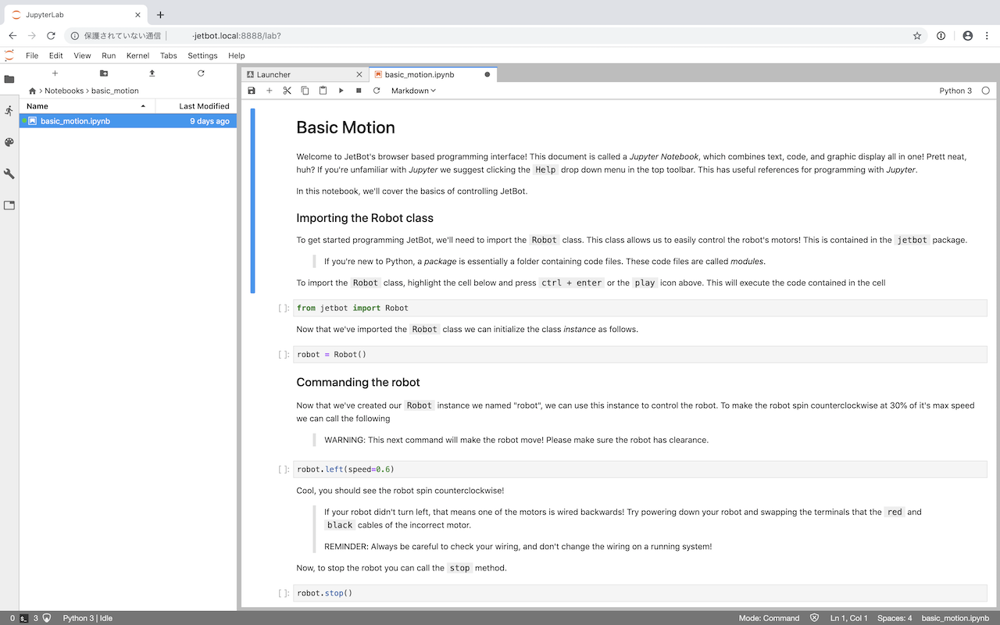
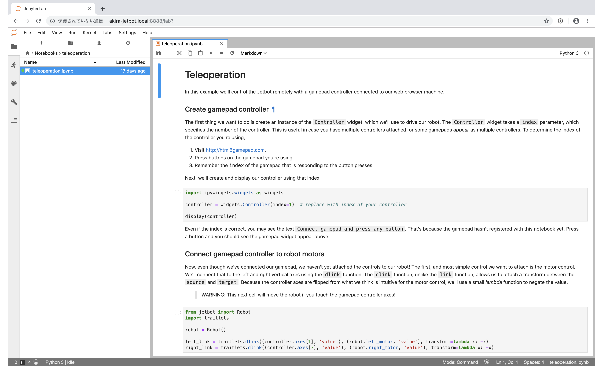
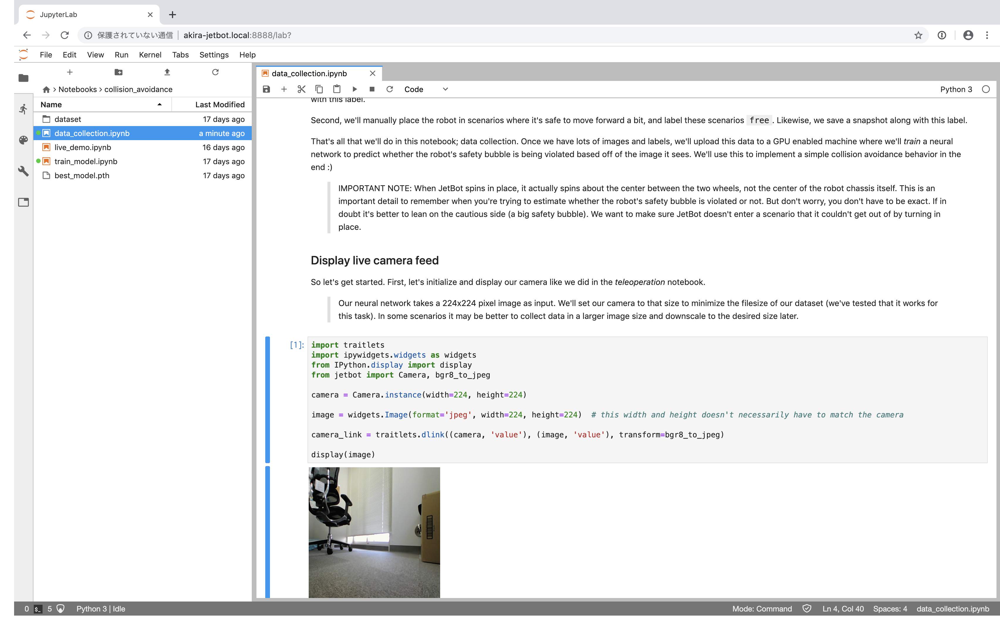
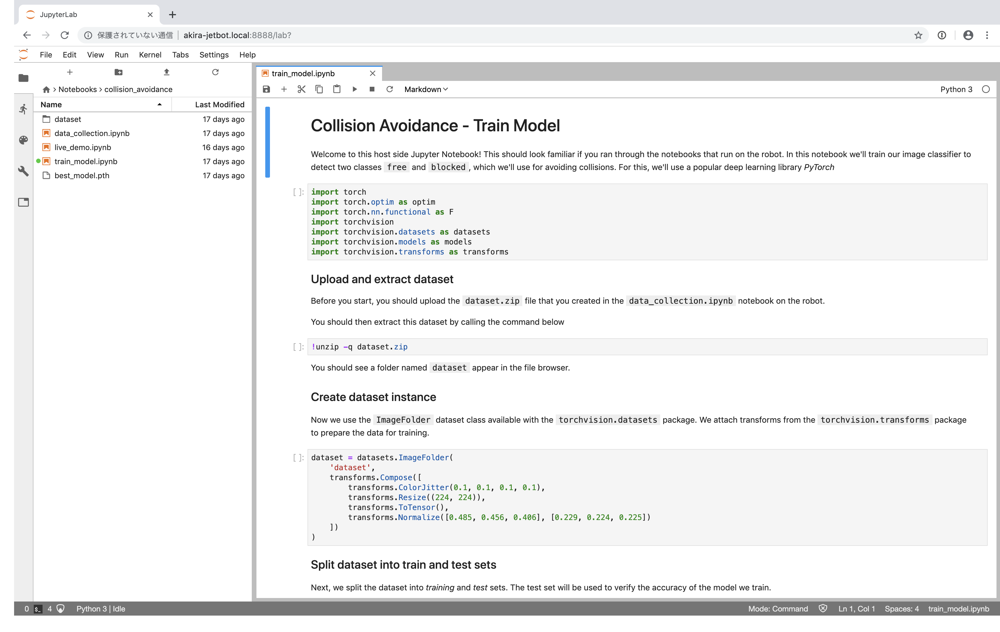
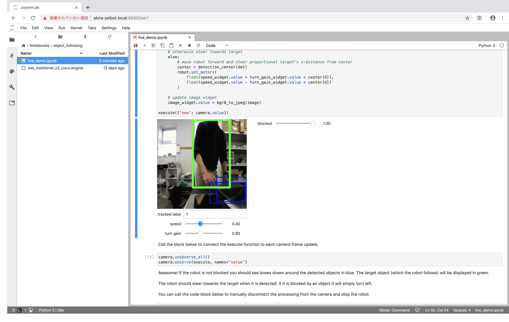

# 事例集

このページはALGYANオリジナルJetbotで試せる事例集です。

> [ソフトウェアのセットアップ](software-setup)を確実に完了しておいてください。

## Example 1 - 基本動作

ウェブブラウザ経由でJetbotをコントロールします。

1. ウェブブラウザから ``http://<自分で設定したホスト名>.local:8888`` に接続する
2. デフォルトのパスワード **jetbot** でログインする
3. ``~/Notebooks/basic_motion/`` に移動
4. [**basic_motion.ipynb**](../../jetbot/blob/master/notebooks/basic_motion/basic_motion.ipynb) ノートブックを開き、指示に従って操作する
    > Jetbotが実際に動きます。十分なスペースを確保してください。

## Example 2 - 遠隔操作

> この項目を試すにはゲームコントローラーが必要です。キットには付属しておりませんので、ここでは原文を示すに留めます。実施したい場合は利用者側でご準備ください。

In this example we'll drive JetBot remotely, view live streaming video, and save snapshots!

1. Connect to your robot by navigating to ``http://<jetbot_ip_address>:8888``

2. Sign in with the default password ``jetbot``
3. Shutdown all other running notebooks by selecting ``Kernel`` -> ``Shutdown All Kernels...``
4. Navigate to ``~/Notebooks/teleoperation/``
5. Open and follow the [``teleoperation.ipynb``](../../jetbot/blob/master/notebooks/teleoperation/teleoperation.ipynb) notebook

## Example 3 - 衝突回避

この事例ではJetbotを安全に走らせるために必要な*イメージ分類*データセットを収集します。Jetbotに``free（障害物なし）`` and ``blocked（障害物あり）`` の2つのシナリオを教えます。このAI分類器を使い、Jetbotが危険な領域に侵入するのを防ぎます。

### Step 1 - Jetbotでデータを集める

> NVIDIAから [訓練済モデル](https://drive.google.com/open?id=1UsRax8bR3R-e-0-80KfH2zAt-IyRPtnW) が提供されています。これを使うことでステップ1、2を省略してステップ3に進むことができます。このモデルは広角レンズを装着したRaspberry Pi V2カメラによって収集された限定的なデータセットを用いて学習されています。本キットではRaspberry Pi V2カメラと同じ画角のUSBカメラを使っており、このモデルをそのまま使用することができます。カメラ位置によって認識精度に影響がありますので、いろいろ試してみてください。

1. ウェブブラウザから ``http://<自分で設定したホスト名>.local:8888`` に接続する
2. デフォルトのパスワード **jetbot** でログインする
3. メニューから **Kernel** -> **Shutdown All Kernels...** を選択し、動作中のカーネルを全て終了する
4. **~/Notebooks/collision_avoidance/** に移動する
5. **data_collection.ipynb** ノートブックを開き、指示に従って操作する

### Step 2 - ニューラルネットワークの学習

#### 選択肢その1 - Jetson nano上での学習

> 本キットには5V AC電源アダプタは付属していません。必要に応じて利用者側で準備してください。

1. Jetbotをシャットダウンし、バッテリーに繋がっている電源ケーブルを取り外す
2. 5V AC電源アダプタを接続し、Jetbotを起動する
3. ウェブブラウザから ``http://<自分で設定したホスト名>.local:8888`` に接続する
4. デフォルトのパスワード **jetbot** でログインする
5. **~/collision_avoidance** に移動する
6. **train_model.ipynb** ノートブックを開き、指示に従って操作する

#### 選択肢その2 - 他のGPU付きPC上での学習

1. PyTorchがインストールされており、Juputer Labサーバーが動作しているGPU付きPCに接続する
2. 衝突回避 [学習用ノートブック](../../jetbot/blob/master/notebooks/collision_avoidance/train_model.ipynb) をこのマシンにアップロードする
3. **train_model.ipynb** ノートブックを開き、指示に従って操作する

### Step 3 - JetBot上で実行

1. Jetbotをバッテリーに接続し、起動する
2. ウェブブラウザから ``http://<自分で設定したホスト名>.local:8888`` に接続する
3. デフォルトのパスワード **jetbot** でログインする
4. メニューから **Kernel** -> **Shutdown All Kernels...** を選択し、動作中のカーネルを全て終了する
5. **~/Notebooks/collision_avoidance** に移動する
6. **live_demo.ipynb** ノートブックを開き、指示に従って操作する
    > Jetbotの周辺に十分な動作スペースを確保し、慎重に作業を進めてください。

## Example 4 - 物体追従

この事例では **人** 、**カップ** 、**イヌ** などを検出することができる学習済モデルを利用し、Jetbotにこれらの物体を追跡させます。これを実行している間、Jetbotは上記の衝突回避を同時に実行し、、自らの安全を保っています。

1. ウェブブラウザから ``http://<自分で設定したホスト名>.local:8888`` に接続する
2. デフォルトのパスワード **jetbot** でログインする
3. メニューから **Kernel** -> **Shutdown All Kernels...** を選択し、動作中のカーネルを全て終了する
4. **~/Notebooks/object_following** に移動する
5. 学習済モデル [ssd_mobilenet_v2_coco.engine](https://drive.google.com/open?id=1RnNBHPDphIOWwHCSfeMCWQ7XN3w3tKFD) をこのフォルダにアップロードする
    > Example 3で利用した衝突回避モデルが **~/Notebooks/collision_avoidance**　に置かれていることも確認してください
6. **live_demo.ipynb** ノートブックを開き、指示に従って操作する
    > Jetbotの周辺に十分な動作スペースを確保し、慎重に作業を進めてください。

## 次に

Jetbotをもっと賢くしましょう。

* 衝突回避用のデータをもっとたくさん集める
* 他のニューラルネットワークアーキテクチャを試してみる ( [torchvision](https://pytorch.org/docs/stable/torchvision/models.html) に多くの事例があります！)
* 衝突回避を利用して別のタスクを実行する（例えば **ネコがいる** / **ネコがいない** を見分け、**ネコがいる** 場合は **駆け出す** など）

まったく新しい何かを造り出しましょう！

* 衝突回避を利用して新しいプロジェクトを立ち上げる
* Jetbotに新しいハードウェアを付け加えることに挑戦してみる（Jetson GPIOや[Adafruit Blinka](https://blog.adafruit.com/2019/03/18/adafruit-blinka-support-for-the-nvidia-jetson-series-nvidia-gtc19-nvidiaembedded/) を利用すると簡単です）
* Modify the collision avoidance example for your own project
* Try out some new hardware with Jetson Nano.  It's easy with Jetson GPIO and [Adafruit Blinka](https://blog.adafruit.com/2019/03/18/adafruit-blinka-support-for-the-nvidia-jetson-series-nvidia-gtc19-nvidiaembedded/)

そしてそれらを共有しましょう。

* [NVIDIA Developer Forums](https://devtalk.nvidia.com/default/board/372/jetson-projects/)
* [IoT ALGYAN](https://algyan.connpass.com)
