# キットの組み立て

このページではALGYAN Jetbotの組み立て方法について説明します。

## 必要な工具、文具

* よく切れるはさみ　または　ニッパー
  * 集団で組み立てを行う場合、全体で1、2本あれば十分です。
  * 既に一度組み立てたことがあれば（バッテリーが固定されていれば）必要ありません。

## あると便利なもの

* ケーブルタイ
  * 配線をうまく固定するときに便利です。
* プラスドライバー
* ラジオペンチ
  * 指でナットを回せないときに便利です。

## 組み立て

### ステップ(1) - 内容物の確認

内容物には箱、または袋単位で番号（梱包番号）が書かれたシールが貼ってあります。それを参照しながら内容物を確認してください。なお説明書とバッテリー固定ガイドシートには番号がありません。

|梱包番号|名称|内容物|
|:--:|--|--|
|1|シャーシ、結束バンド|袋の内容は下記の通りです|
|2|バッテリー|cheero 10000mAh|
|3|無線LANドングル|Buffalo|
|4|USBカメラ|Buffalo|
|5|車輪・モーター|車輪2個、モーター2個|
|6|電源ケーブル|片方がUSB-A、反対側がDCプラグ|
|7|USBケーブル|片方がUSB-A、反対側がマイクロUSB-B|
|8|プラスねじ,ナット、ショートピン|ネジ4本、ナット4個、ショートピン1本|
|9|キャスター|キャスター|
|10|PiOLED|OLEDディスプレイ基板|
|11|モータードライバ|モータードライバ基板|
|12|コネクタ基板|電源接続用基板|
||説明書||
||バッテリー固定ガイドシート||

シャーシ袋の内容物は以下の通りです。

|名称|個数|説明|外観|
|:--:|:--:|:--:|:--:|
|左サイド|1個|01Lの刻印があります|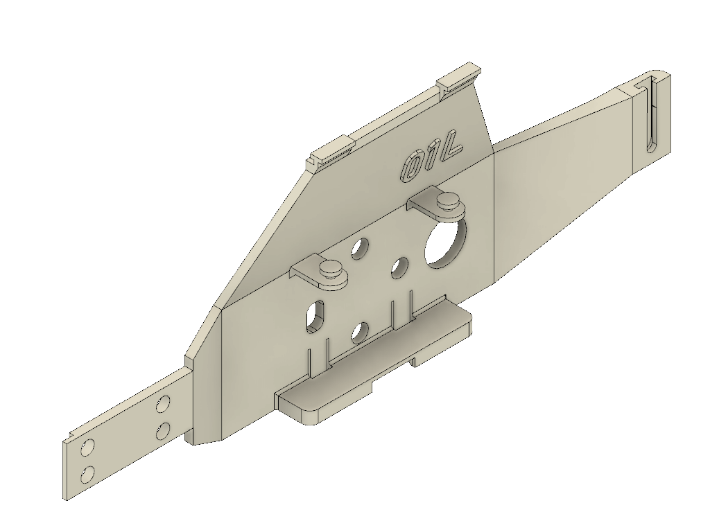|
|右サイド|1個|01R|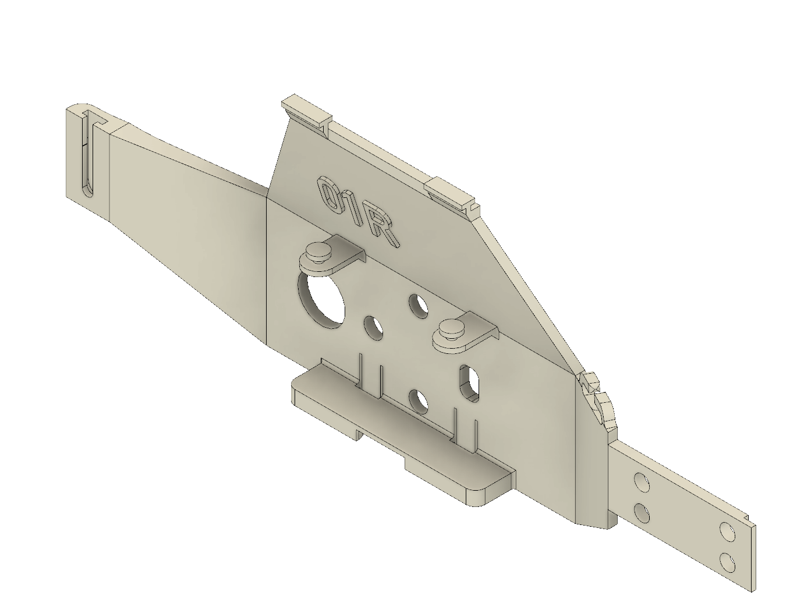|
|基板ホルダー（前）|1個|02F|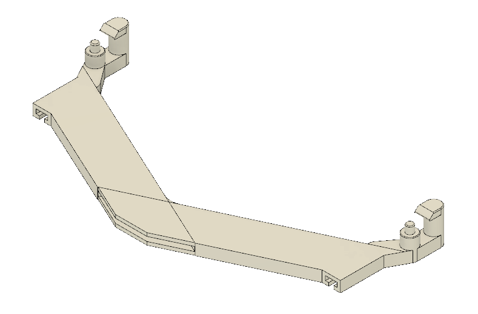|
|基板ホルダー（後）|1個|02R|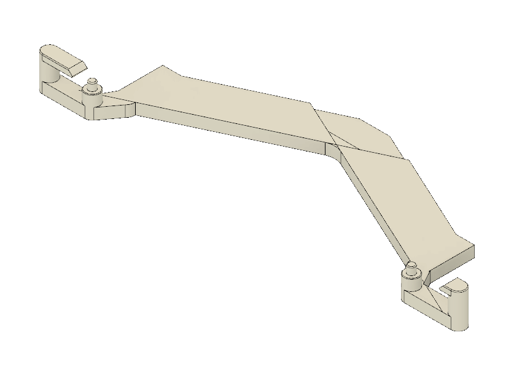|
|連結板（中）|1個|03|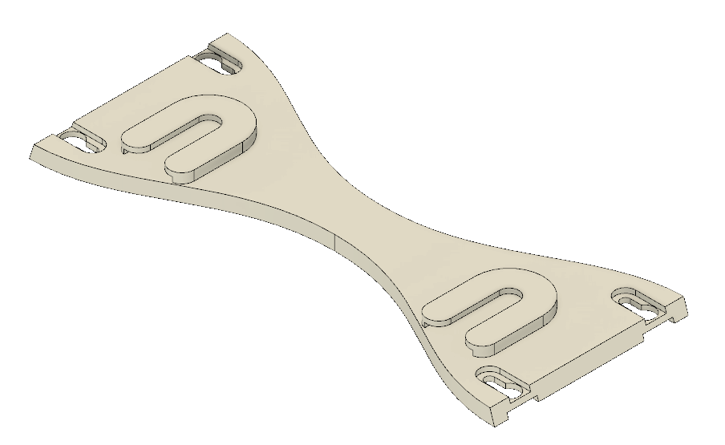|
|連結板（下）|1個|04|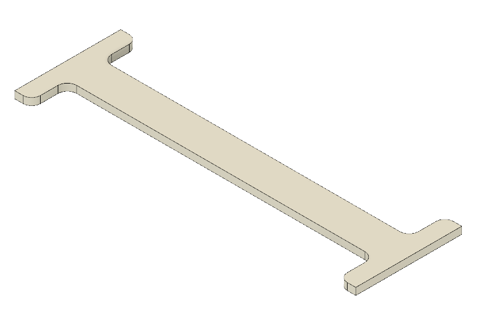|
|キャスターベース（上）|1個|05T|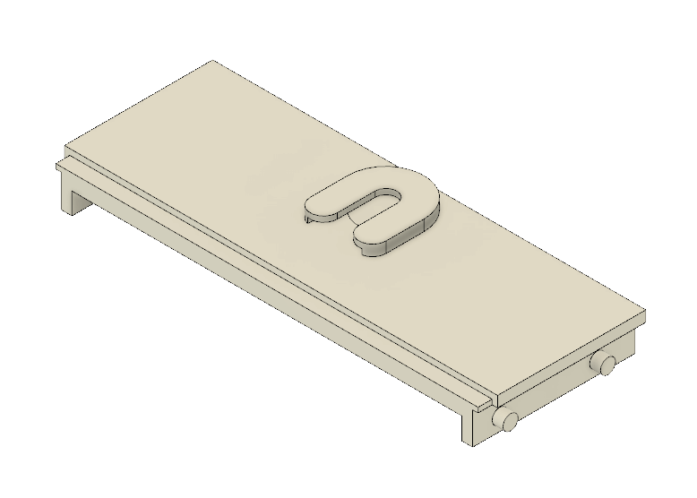|
|キャスターベース（下）|1個|05B|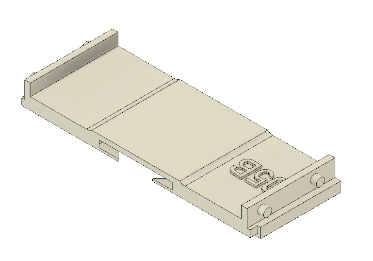|
|キャップ|1個|06|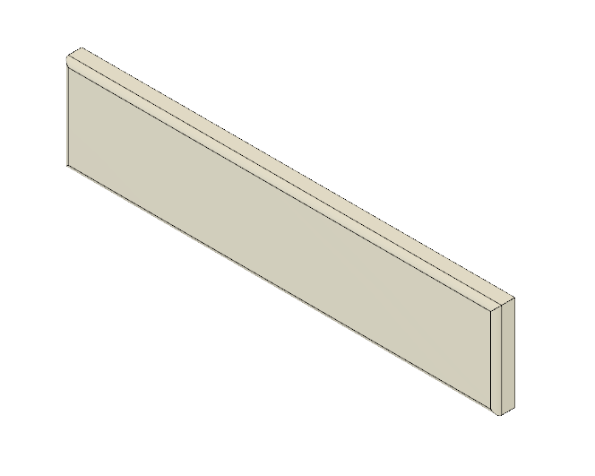|
|バッテリーホルダー|1個|07|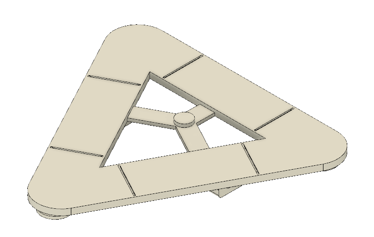|
|カメラホルダー|1個|08|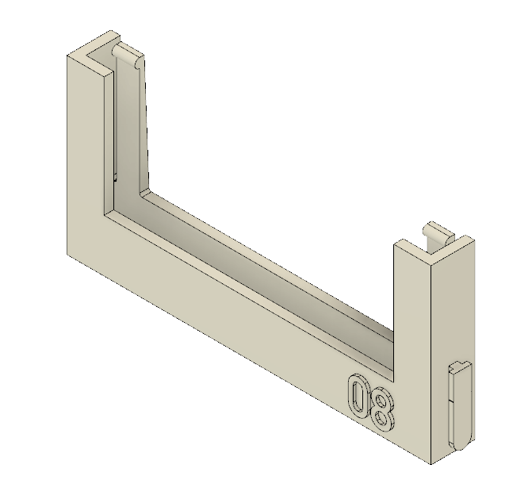|
|結束バンド|1本|なし|長さ30cmのプラスチック製バンド|

### ステップ(2) - バッテリー組み立て

> 使用済みキットを再利用している場合、既にこの作業が終わっていることがあります。その場合は **ステップ(3)** に進んでください。

バッテリーと【07 バッテリーホルダー】を固定します。添付の「バッテリー固定ガイドシート」に従って作業してください。シートは[ここ](BatteryHolder-Template.pdf)からも入手できます。シートを印刷する際には等倍（100%）になっていることを必ず確認してください。

1. ガイドシート、バッテリー、【07 バッテリーホルダー】を用意します。
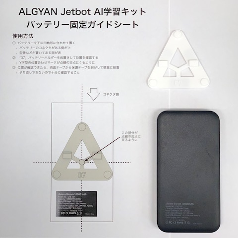
1. ガイドシートの上にバッテリーを置きます。
1. ガイドシートの指示に従い、バッテリーホルダーの位置合わせを練習します。
    * バッテリーホルダー中央のY字の交点が、ガイドシートの点線の交点と一致する
    * バッテリーとバッテリーホルダーの向きがなるべく揃うように
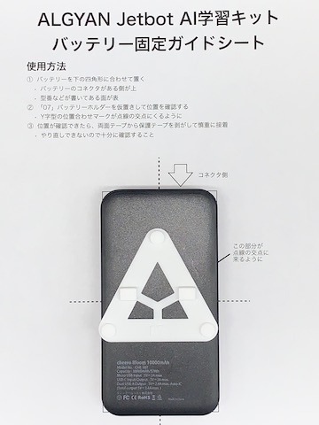
1. バッテリーホルダーに付いている両面テープの保護フィルムを剥がします。
1. バッテリーホルダーをバッテリーに接着します。
    * 練習した位置となるべく同じになるようにします（5ミリ程度のずれは問題ありません）。
1. 結束バンドを用意します。
1. バッテリーホルダーのフックに結束バンドを引っかけます。
    * 結束バンドは左側の突起が上向きになるようにします。
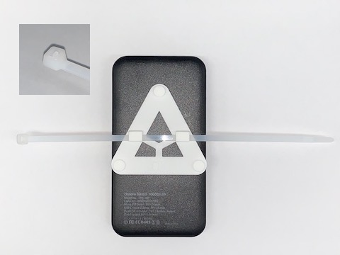
1. 結束バンドの細い方をバッテリーの向こう側から左に回し、下から穴に差し込みます。
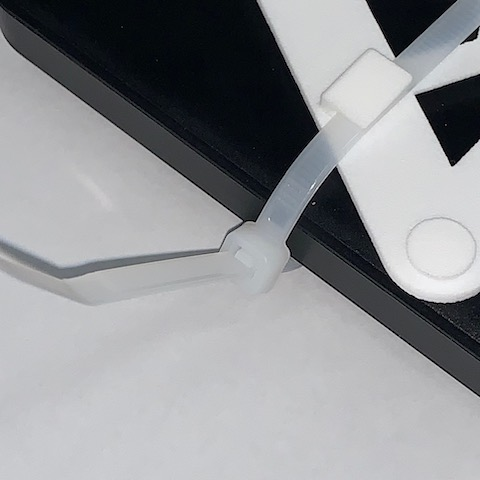
1. バンドがフックから外れないよう注意しながら、**なるべくしっかり**締め付けます。
    * かなり強く引っ張っても大丈夫です。
    * バンドが締まるとカチカチ音がします。この音がしなくなるまで締め付けてください。
1. よく切れるはさみ、またはニッパーで余った部分を切り取ってください。
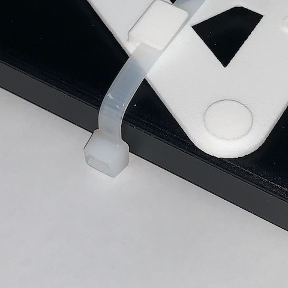
    * 切れの悪いはさみを使うと余分な力が必要になり、ケガをしやすくなります。十分注意して作業してください。

### ステップ(3) - モーター取り付け

1. シャーシの【01L 左サイド】、【01R 右サイド】を確認して手元に用意します。
1. モーター（左）、モーター（右）を確認して手元に用意します。
    * モーターには左右があります。ケーブルが長い方が（左）、短い方が（右）です。
    * キットのロットによっては、モーターに左右を示すシールが貼ってあります。
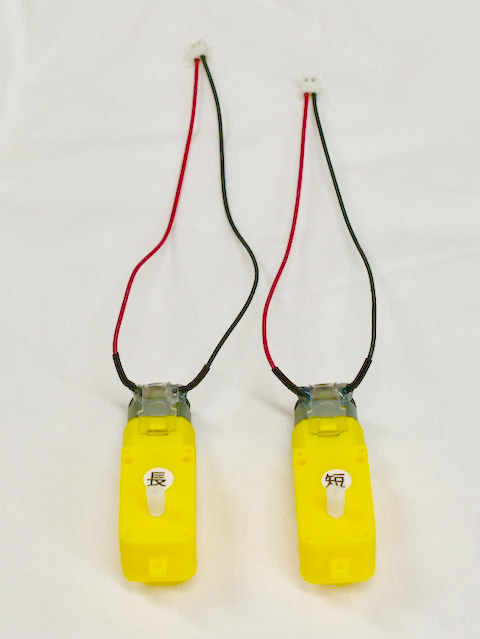
1. プラスねじ 4本、ナット 4個を手元に用意します。
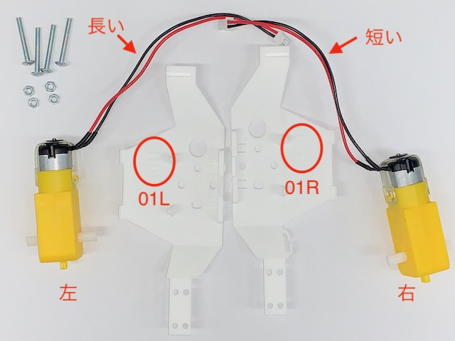
1. シャーシの左サイドにモーター（左）をネジ止めします。
1. シャーシの右サイドにモーター（右）をネジ止めします。
    * この時、写真のとおりモーターの配線が　**内側になるように**　止めてください。
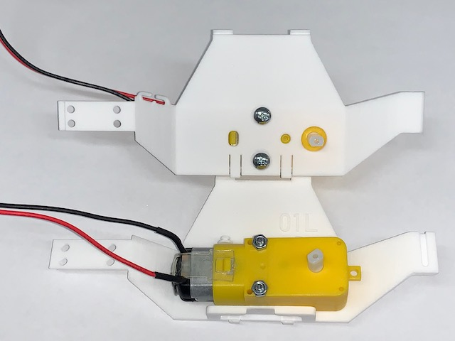

### ステップ(4) - シャーシ組み立て

1. キャスターを【05B キャスターベース（下）】にはめてください。
    * 四角形に合わせてはめ込んだ後、キャスターを反時計まわり（左まわり）に止まるまで回します。
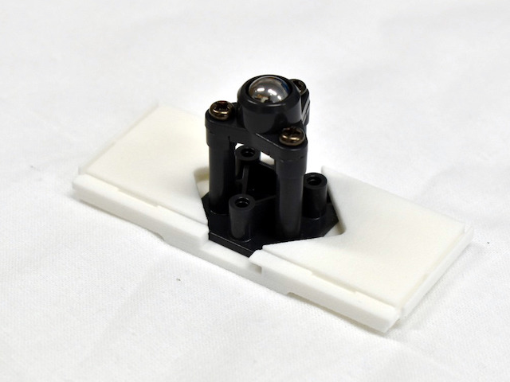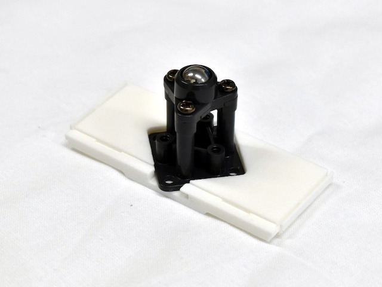
1. 【01L 左サイド】と【01R 右サイド】を【03 連結板（中）】で接続します。
    * 連結板の上にあるU字型の構造が後ろ側に開くような向きにします。
    * ピンを折らないよう注意してください。
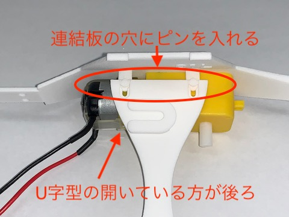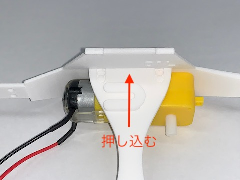
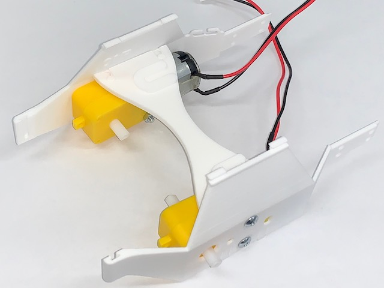
1. 【04 連結板（下）】を両サイドの下側にはめてください。
    * 連結板（下）には上下、左右はありません。上から軽く押すとはまります。
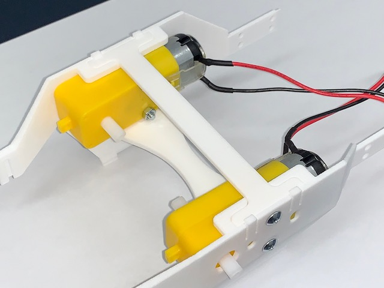
1. 【02F 基板ホルダー（前）】を両サイドの上、前側の突起にはめてください。
1. 【02R 基板ホルダー（後）】を両サイドの上、後ろ側の突起にはめてください。
    * 前後の基板ホルダーがうまくはまるようにしてください。
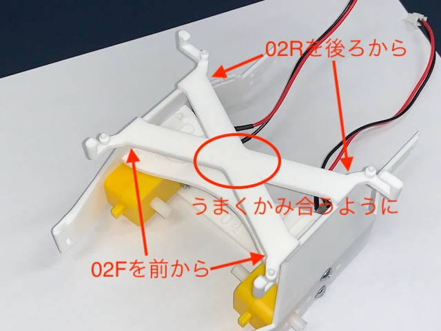

1. 【05T キャスターベース（上）】を両サイドの後ろ側にはめて下さい。
    * キャップがはまる凹みが後ろになる向きです。
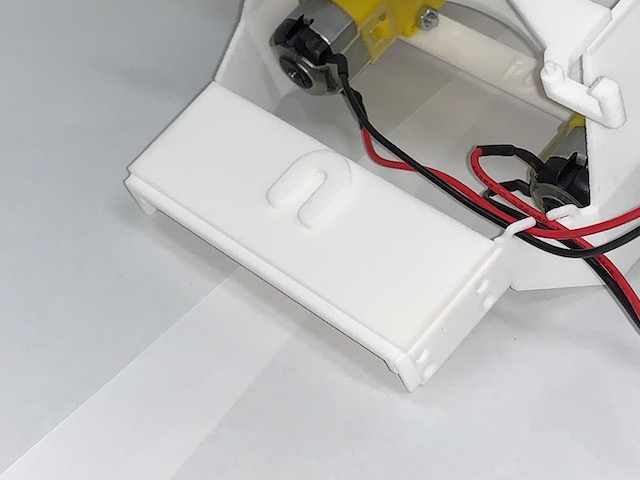
1. 【05T キャスターベース（下）】を両サイドの後ろ側にはめて下さい。
    * キャップがはまる凹みが後ろになる向きです。
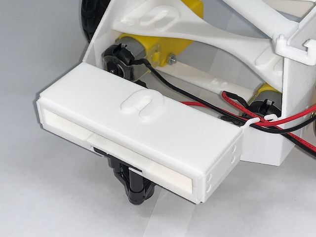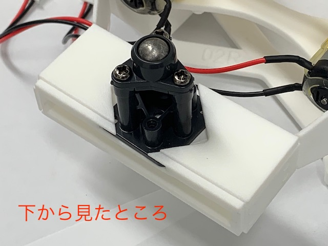
1. キャスターベースに【06 キャップ】をはめて固定してください。
    * キャップに上下はありません。
    * キャップがゆるい場合はセロハンテープなどで軽く固定してください。
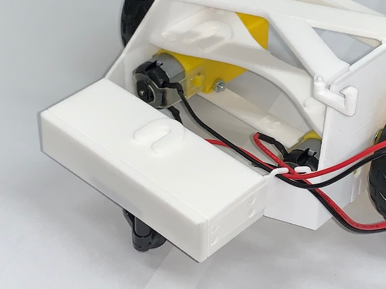
1. 【08 カメラホルダー】を両サイドの前側にはめてください。
    * 押さえバネが前になる向きです。
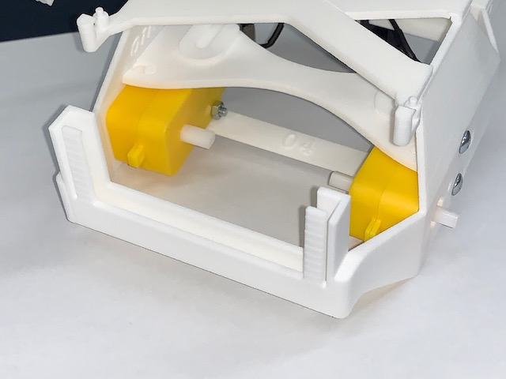

### ステップ(5) - 車輪取り付け

1. 左右の車輪をモーターの車軸に取り付けてください。
    * 車軸の切り欠き部分が車輪の穴にうまくはまるようにしてください。
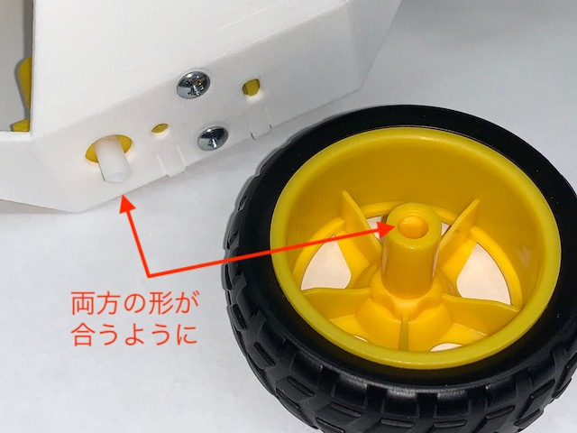

### ステップ(6) - バッテリー取り付け

1. ケーブルをサイドのフックに引っかけます。
    * バッテリー付け外しの邪魔にならないようにするためです。
    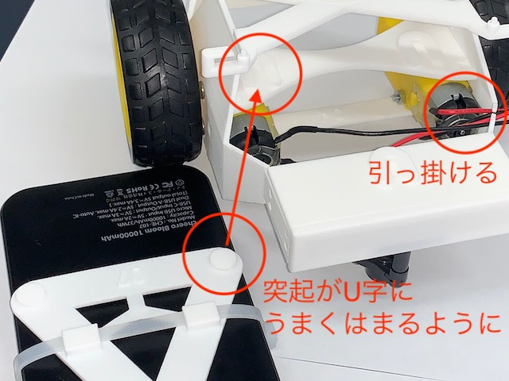
1. バッテリーをシャーシに取り付けてください。
    * バッテリーホルダーの突起がうまくシャーシにはまるようになっています。
    * まず前側の2つの突起が連結板（中）のU字型にうまくはまるようにします。
    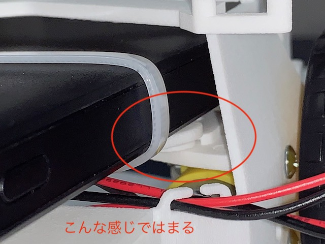
    * その後、バッテリーを前に押しながら後ろの突起がキャスターベース（上）にはまるようにします。

### インターミッション - ソフトウェアのセットアップ

ここでJetson nanoのソフトウェアのセットアップ（前半）を行います。

1. ショートピンをJetson nanoのJ48端子に挿入します。
    * カメラ端子の隣にある2本のピンです。
1.ソフトウェアの[セットアップ](software-setup)を参照し、作業を進めてください。

### ステップ(7) - Jetson nano取り付け

1. Jetson nanoの拡張端子（40ピン）にモータードライバ基板を挿入します。
    * モータードライバ基板のスイッチが「ON」になっていることを確認してください。
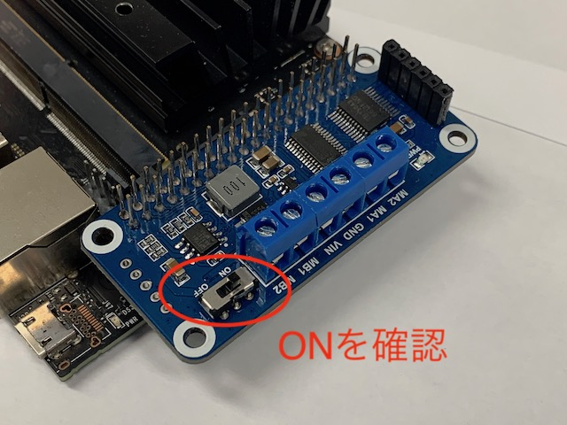
1. モータードライバ基板の上にコネクタ基板を挿入します。
    * メインの40ピンと奥側の6ピンがちゃんと刺さっていることを確認してください。
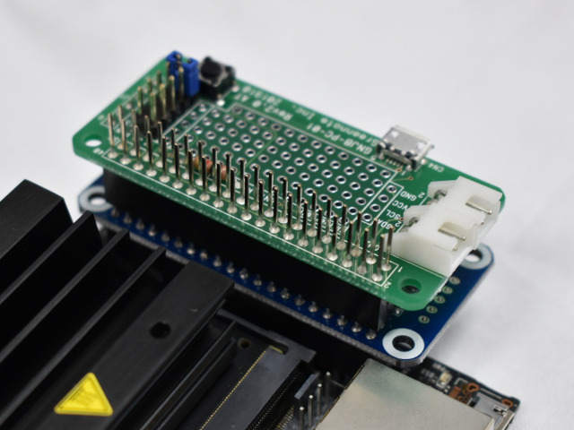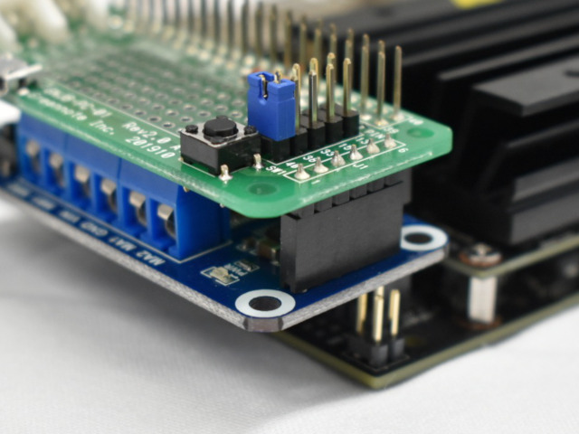
1. コネクタ基板の上にPiOLEDを挿入します。
    * 位置と向きに注意してください。
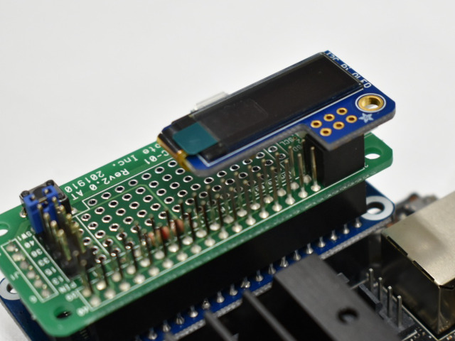
1. 無線LANドングルをJetson nanoのUSB端子に接続してください。
1. Jetson nano基板の前側（コネクタの反対側）にある2つの穴が、基板ホルダーの前側にある2本のピンにはまるようにします。
    * 基板をななめに差し込み、位置を合わせながら下げていくとよいでしょう。
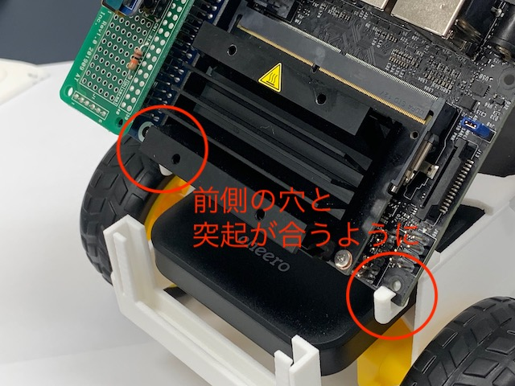
1. Jetson nano基板を後ろに倒し、後ろ側の2つの穴が基板ホルダーの後ろ側にある穴にはまるように位置合わせします。
    * 基板ホルダーがずれているとうまく合いません。前後に押さえてみてください。
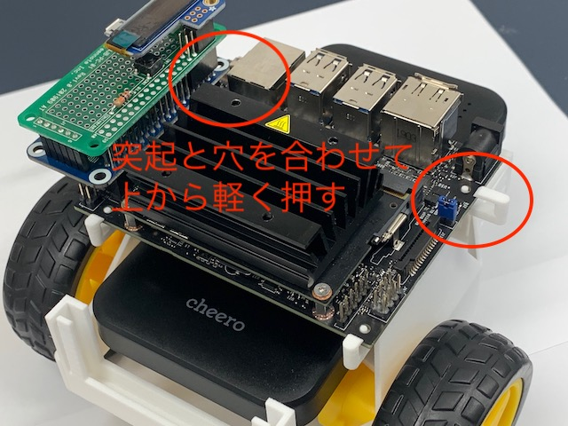
1. 基板ホルダーのフックが基板に引っかかる位置まで少し力を入れて基板を押し込みます。

### ステップ(8) - 配線

1. モーターの配線をコネクタ基板に挿入します。
    * モーターとコネクタの方向が同じになるようにします。つまり
      * 左側モーターの配線は左側のコネクタに、
      * 右側モーターの配線は右側のコネクタに挿入します。
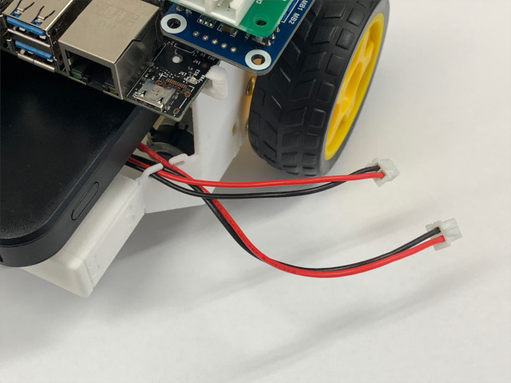
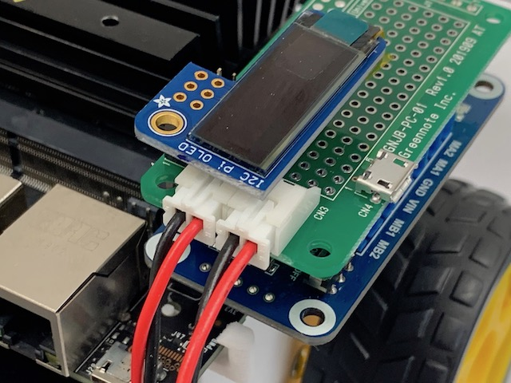
1. USBカメラをカメラホルダーに取り付け、USB端子をJetson nanoに接続してください。
    * カメラの台座がホルダーにはまるようになっています。
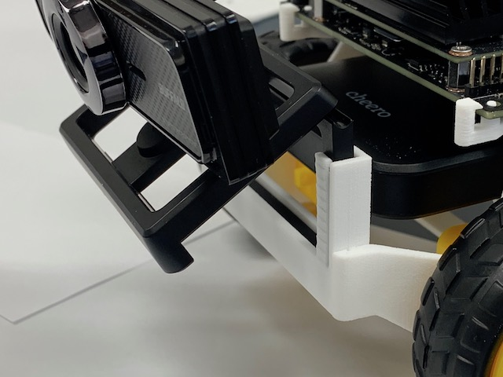
1. USBケーブルのA端子をバッテリーに挿入し、マイクロB端子をコネクタ基板に接続してください。
    * 2つあるポートのどちらに接続してもかまいません。
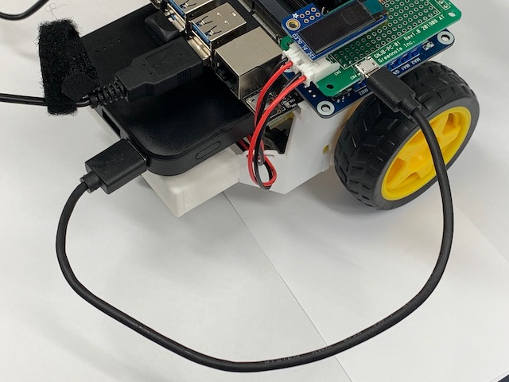
1. 電源ケーブルのA端子をバッテリーに挿入してください。
    * DCプラグをJetson nanoに接続するとnanoが起動していまいます。
1. 配線類が走行の妨げにならないよう、ケーブルタイで固定しておくといいでしょう。

## 次のステップ

* ソフトウェアの[セットアップ](software-setup)後半に進んでください。
