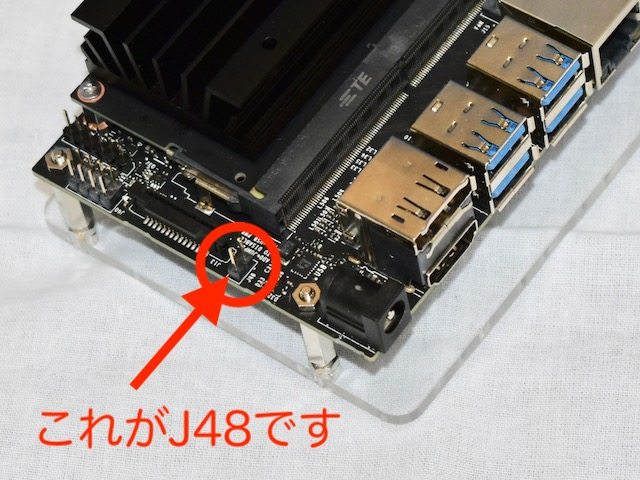
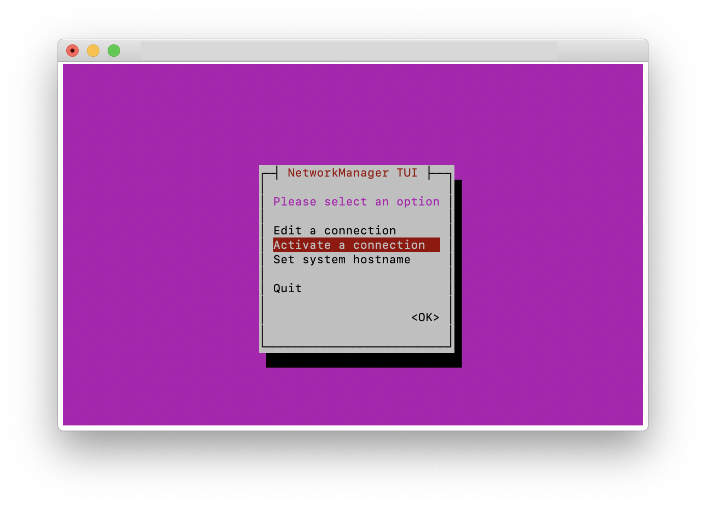
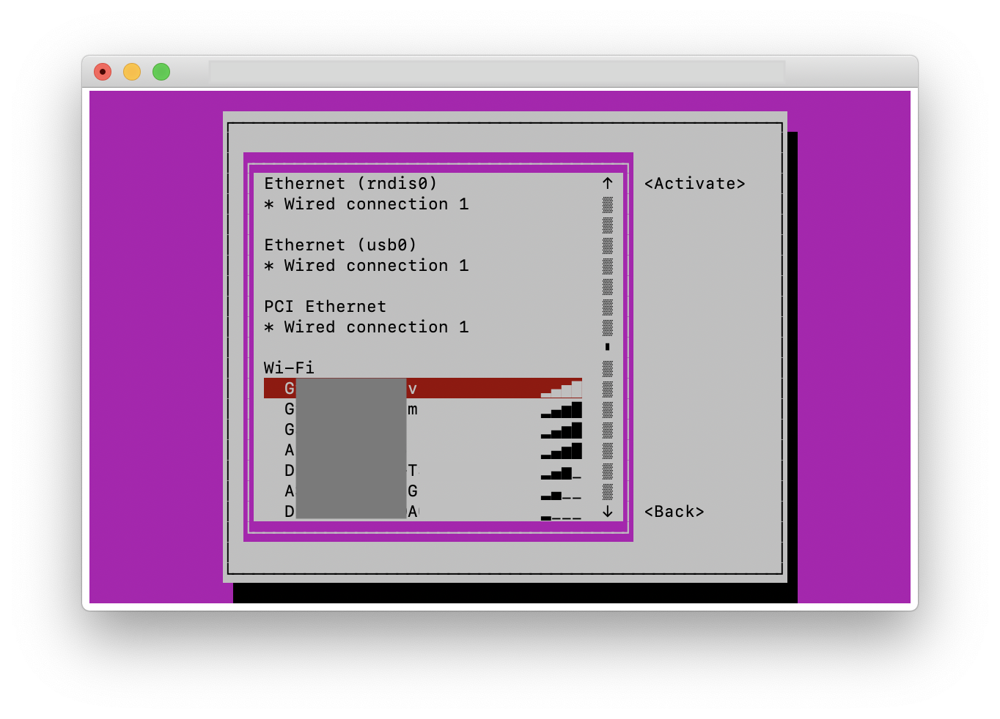
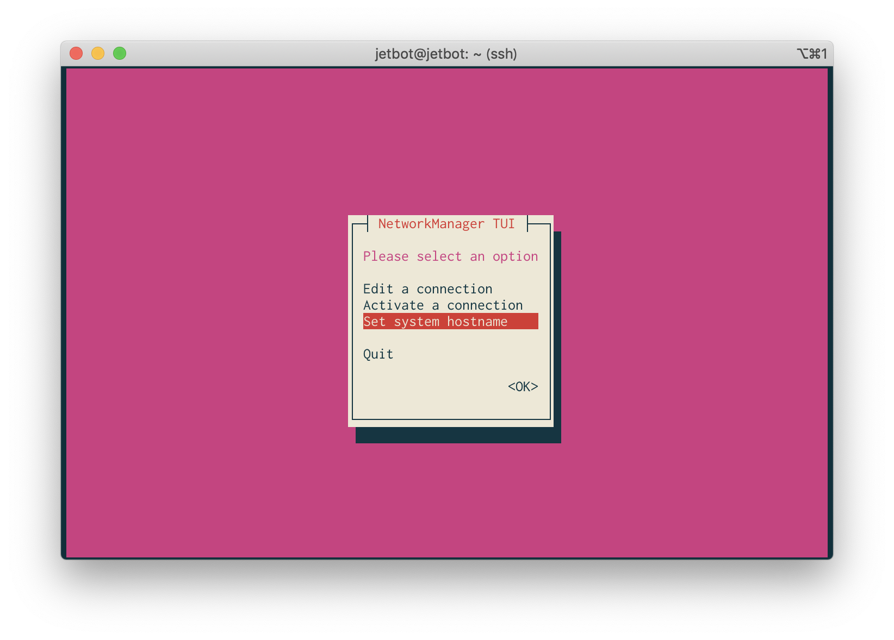

# ALGYAN Jetbot ソフトウェアのセットアップ

ソフトウェアのセットアップ手順について説明します。セットアップは前半と後半に分かれており、前半はJetson nanoを車体シャーシに乗せる前に行います。これは、基本的な設定をできるだけ素の状態のJetson nanoで行うためです。

## Step 1 - JetbotイメージファイルをマイクロSDカードに書き込む

ALGYANオリジナルJetbotで使用するマイクロSDカードは本家と同じものです。マイクロSDカードは最低32GB、できれば64GB以上の容量のものをお勧めします。低速のものでも動作すると思われますが、予算が許すかぎり高速なものを利用する方が動作が安定するかもしれません。

1. JetBot SD card image 拡張用 [jetbot_image_v0p3p2.zip](https://drive.google.com/open?id=1GF2D814hkViwluZ5SgNKW56cQu_5Ekt5) をダウンロード

    > 2020年3月時点での最新版  **jetbot_image_v0p4p0.zip** での動作は保証しません。NVIDIA公式から「[required for B01 revision of Jetson Nano Developer Kit（当社訳：Jetson Nano開発キットのバージョンB01が必要です）](https://github.com/NVIDIA-AI-IOT/jetbot/releases/tag/v0.4.0)」とのアナウンスが出ているためです。現状、当社キットのユーザ様の大半がバージョンA01をお使いです。

2. マイクロSDカードを作業用PCに挿入する
3. [Etcher](https://www.balena.io/etcher/)などを使って``jetbot_image_v0p3p0.zip``に含まれるイメージをマイクロSDカードに書き込む
4. 作業用PCからマイクロSDカードを取り出す

### Step 2 - Jetson Nanoを起動する

1. マイクロSDカードをJetson Nanoモジュールの下側にあるスロットに挿入する

2. 作業用PCとJetson nanoをUSB A-マイクロUSBケーブルで接続する

3. ショートピンがJetson nanoのJ48端子に挿入されていることを確認する
    * ハードウェアのセッティングをマニュアル通りに行っていれば問題ないはずです。
     

4. Jetson nanoの電源端子に製品付属の電源ケーブル（片方がUSB-A、反対側がDCプラグ）を接続し、反対側をUSBバッテリーに接続してください。接続が完了したらバッテリー横のボタンを押す（電源ON）

### Step 3 - Jetson nanoの初期設定

Jetson nanoはマイクロUSB端子にPCを接続することで、簡易的なネットワーク接続を行うことができます。PCからは固定アドレス 192.168.55.1 でJetson nanoにアクセスすることができます。

----

### macOS Catalina以降をお使いの方へ

macOS Catalina以降ではこの方法で接続することができません。

1. DHCPが利用できる有線LANにMacとJetBotを両方接続し、OLED画面に表示されるIPアドレスを用いて作業を進める
1. 別のPC（macOS Catalinaでないもの）を使用して無線LANの設定までを完了させる
    * 無線LANに繋がるようになれば、macOS Catalina以降でもそれを経由して作業を継続できます。
1. [別資料](Catalina)に従い、JetBot内のソフトウェアを書き換える
    * Linuxの操作に慣れている方であれば、これが一番早いと思います。逆に、Linuxを良く知らない方にはお勧めしません。

### 指導者の方へ

JetBotキットをセミナーや授業などで活用する際、作業用PCにmacOS Catalina以降が含まれていると大きな時間のロスとなる可能性があります。

1. 指導者側でいったんマイクロSDカードを作成した後、上記3.の作業を実施した後にコピーを作成し、作成済みSDカードとして配布する
1. 設定用の有線LANを用意する

などの対策をお勧めします。

----

1. SSHクライアントでJetson nanoに接続し、user ``jetbot`` 、password ``jetbot``でログインする

    ```sh
    $ ssh jetbot@192.168.55.1
    ```

1. 自動アップデートをOFFにする
  自動的にubuntuのアップデートが開始されないようにしておきます。下記の通り`/etc/apt/apt.conf.d/20auto-upgrades` を修正してください。編集にはroot権限が必要です。

      ``` sh
      $ cat /etc/apt/apt.conf.d/20auto-upgrades
      APT::Periodic::Update-Package-Lists "0";  // 初期状態"1"を"0"に書き換えます
      APT::Periodic::Unattended-Upgrade "0";    // 初期状態"1"を"0"に書き換えます
      ```

1. nmtuiコマンドを使ってネットワーク接続の設定を行う

    ```sh
    $ sudo nmtui
    ```

    1. Activate a connection を選択
        

    1. 管理者から指定されたWi-Fiアクセスポイントを選択する
        

    1. 管理者から与えられたパスワードを入力し、*OK*を押す
        

    1. 接続できたら\<Back\>を 押してメインメニューに戻る

    1. Set system hostname を選択する
        

    1. Jetson nanoのホストネームを入力する
        * 他の学習者と被らない名前にすること
        * 管理者から指示があればそれに従う
        

    1. ``<OK>``、``<Quit>``を順に押して設定終了

1. タイムゾーンを日本(Asia/Tokyo)に設定する

      ```sh
      $ sudo timedatectl set-timezone Asia/Tokyo
      ```

1. mDNS (avahi)の設定を行う
    Jetson nanoにアクセスする際、IPアドレスではなくホスト名でアクセスできるようにする設定です。
    1. エディタを使い、下記の内容のファイル /etc/avahi/services/ssh.service を作成する

      ```xml
      <?xml version="1.0" standalone='no'?>
      <!DOCTYPE service-group SYSTEM "avahi-service.dtd">

      <service-group>
        <name replace-wildcards="yes">%h</name>
        <service>
          <type>_ssh._tcp</type>
          <port>22</port>
        </service>
      </service-group>
      ```

    1. 設定ファイルを有効にする

      ```sh
      $ sudo systemctl restart avahi-daemon.service
      ```

1. 無線LANアダプタのパワーマネジメント機能をOFFにする
      > UbuntuベースのLinuxを使ったワンボードマイコンでは、USBタイプの無線LANアダプタを使用した時にパフォーマンスがおおきく損なわれる現象があることが知られています。ここではそれを回避するための設定を行います。

    1. 無線LANアダプタの設定を確認する

        ```sh
        $ iwconfig wlan0 | grep Power\ Management
        Power Management:on
        ```

        Power Managementがonになっていることを確認してください。既にoffになっている場合は、この項目の作業を実施する必要はありません。

    1. rootユーザになる

        ```sh
        $ sudo su -
        #
        ```

        パスワードの入力を求められることがあります。 `jetbot` と入力してください。

    1. cronの設定を行う

        ```sh
        # echo "* * * * * /sbin/iwconfig wlan0 power off" | crontab
        # crontab -l
        * * * * * /sbin/iwconfig wlan0 power off
        # exit
        $
        ```

        Power Managementの設定はシステムによって上書きされることがあるため、1分間隔で更に上書きしてやるという動作を行います。

    1. 動作確認

        1分程度待ってから、下記の通りPower Managementの状態を確認します。

        ```sh
        $ iwconfig wlan0 | grep Power\ Management
        Power Management:off
        ```

        Power Managementがoffになっていれば成功です。onのままになっている場合は、更に1分程度待ってからまた試してみてください。それでもonのままの場合は、上記作業    のどこかに誤りがあると思われます。もう一度内容を確認しながら作業してください。

1. Jetbotのプログラムを書き換える
　　1. プログラム一式を入手する

      ```sh
      $ git clone https://github.com/greennote-inc/algyanjetbot.git
      $ cd algyanjetbot
      $ sudo python3 setup.py install
      $ sudo apt-get install rsync
      $ rsync -r notebooks/ ~/Notebooks/
      $ cd patch
      $ sudo patch /usr/local/lib/python3.6/dist-packages/Adafruit_MotorHAT-1.4.0-py3.6.egg/Adafruit_MotorHAT/Adafruit_MotorHAT_Motors.py Adafruit_MotorHAT_Motors.patch
      ```

      * `sudo apt-get install rsync` の際に下記のようなエラーがでた場合はJetson nanoの自動アップデートが行われています。Step 3の2.自動アップデートOFFの処理ができていないものと思われます。しばらく待ってから再度実行してください。ただし回線状況によっては非常に時間が掛かる可能性がありますので、いったん再起動しても構いません。その際は自動アップデートOFFの処理を完了してから再起動するようにしてください。

        ```sh
        $ sudo apt-get install rsync
        E: Could not get lock /var/lib/dpkg/lock-frontend - open (11: Resource temporarily unavailable)
        E: Unable to acquire the dpkg frontend lock (/var/lib/dpkg/lock-frontend), is another process using it?
        ```

1. Wi-Fi接続を確認する
    1. 作業用PCがJetson nanoと同じWi-Fiに接続していることを確認する
    1. ホスト名でアクセスできることを確認する

      ```sh
      $ ssh jetbot@(自分で設定したホスト名).local
      ```

      * 少し時間が掛かります。しばらく待っても接続できない場合は設定を見直して下さい。

1. システムをシャットダウンする

    ```sh
    $ sudo shutdown -h now
    ````

これで設定の前半は終了です。ハードウェアのセッティングに戻ってください。ハードウェアのセッティングが完了したら次の作業から再開します。

### Step 4 - ウェブブラウザでJetBotに接続

1. バッテリー横のボタンを押す（電源ON）
2. Jetbotが起動するのを待つ
    > 正常に起動すればOLEDディスプレイにWi-Fi接続のIPアドレスが表示されます。まれに起動に失敗することがあります。
3. ブラウザから ``http://<自分で設定したJetson Nanoのホスト名>.local:8888`` に接続する
    > ホスト名が「algyan-jetbot」だとすると、接続先は ``http://algyan-jetbot.local:8888`` になります。
    > ブラウザはChromeを使うことをお勧めします。Safariでは文字が正常に入手できない現象が起こることを確認しています。
4. Jupiter Notebookのログイン画面がでるので、パスワード ``jetbot`` でログインする

### Step 5 - パワーモードの設定

ALGYAN Jetbotで使用している電源系の供給能力には限りがあり、Jetson Nanoをフルパワーで動作させることはできません。パワーモードを ``5W`` に設定して電力消費を抑えます。

1. ブラウザから ``http://<自分で設定したJetson Nanoのホスト名>.local:8888`` に接続し、Jupiter Notebookにログインする
    > Step 4から継続して作業する場合は既に接続済のはずです。

2. ``+`` アイコンを押してランチャーを表示する
3. ターミナルを起動する
4. 下記のコマンドを実行して5Wモードに設定する

    ```bash
    sudo nvpmodel -m1
    ```

5. 正しく5Wモードに設定されたことを確認する

    ```bash
    sudo nvpmodel -q
    ```

## 次のステップ

 [examples](examples)に進んでください。
