# ALGYAN Jetbot トラブルシュート

ALGYAN Jetbotが動作しない時は、下記の手順に従って対応してください。

## Step 0. 状況の把握

以下のどの事例に対応するか確認してください。

1. Jetson nanoが起動しない
2. Jetson nanoは起動するが、PCから接続できない
3. PCから接続はできるが、Wi-Fiの設定ができない／繋がらない
4. Wi-Fi設定まで完了しているが、PCからWi-Fi経由でJupiter Notebookに接続できない
5. Jupiter Notebookには接続できるが、Basic Motionが途中でエラーになる

## 事例1. Jetson nanoが起動しない

[作成中]

## 事例2. Jetson nanoは起動するが、PCから接続できない

[作成中]

## 事例3. PCから接続はできるが、Wi-Fiの設定ができない／繋がらない

PCとUSB接続してログインはできたが、W-Fiの設定ができない／繋がらない場合の対応手順です。

* 状況確認方法
  * OLEDディスプレイの ``wlan0`` にIPアドレスが表示されている場合はWi-Fi接続できています。事例4に進んでください。
  * 無線LANドングルの青いランプが点滅していますか？　点滅している場合は `Step 1.` に進んでください。常時点灯になっている場合、まったく点灯していない場合は何らかの原因でJetbotの起動が失敗しています。いったん電源ケーブルを取り外し、10秒以上待ってから改めて起動してください。

### Step 1. 接続情報の確認

まずは、他のPCやタブレット、スマホなどでWi-Fiアクセスポイントに接続できることを確認してください。その際、アクセスポイント名（SSID）、パスフレーズを間違いなくメモしておいてください。

* 注意点
  * Jetbotキットは2.4GHz帯しか対応していません。5GHz帯のアクセスポイントには接続できないので注意してください。

### Step 2. USB経由でPCを接続して起動

既に説明したとおりの方法で、作業用PCとJetbotをUSBケーブルで接続し、起動してください。起動したらしばらく待ち、作業用PCからJetbotに `ssh jetbot@192.168.55.1` でSSH接続します。

### Step 3. JetbotがWi-Fiの電波を受信できているかどうかの確認

コンソールから `nmcli d wifi list` を実行し、Jetbotから見えているWi-Fiアクセスポイント名、およびその接続状態を確認してください。

```sh
$ nmcli d wifi list
IN-USE  SSID           MODE   CHAN  RATE        SIGNAL  BARS  SECURITY
*       （SSID名）      Infra  6     130 Mbit/s  77      ▂▄▆_  WPA1 WPA2
$
```

接続しようとしているアクセスポイントが表示されている場合は `Step 5.` に進んでください。アクセスポイント名が出ていない場合、Wi-Fi管理者に「SSIDがステルスモードになっているかどうか」を確認してください。

* ステルスモードになっている場合
  * Step 4.に進んでください。
* ステルスモードになっていない場合
  * 何らかの原因で（2.4GHz帯に対応していない、など）Jetbotはそのアクセスポイントに接続することができません。他のアクセスポイントを用意してください。
  * なお、Jetbotの設定が完了した後はインターネット接続は必要ありません。作業用PCとJetbotが通信できれば十分です。従って、予備のアクセスポイントを単独で使用することができます。

### Step 4. ステルスモードのアクセスポイントにアクセスできるようにする

コンソールから `sudo iwlist wlan0 scanning （アクセスポイント名）` を実行し、ステルスモードのアクセスポイントが検出できるようにしてください。

```sh
$ sudo iwlist wlan0 scanning essid （アクセスポイント名）
（大量の情報が表示されます）
$
```

実行が完了したら、再び `nmcli d wifi list` を実行し、アクセスポイント名が表示されることを確認してください。

* アクセスポイント名が表示されない場合
  * 何らかの原因で（2.4GHz帯に対応していない、など）Jetbotはそのアクセスポイントに接続することができません。他のアクセスポイントを用意してください。
  * なお、Jetbotの設定が完了した後はインターネット接続は必要ありません。作業用PCとJetbotが通信できれば十分です。従って、予備のアクセスポイントを単独で使用することができます。

### Step 5. アクセスポイントの設定を行う

ここまで完了していればJetbotはWi-Fiアクセスポイントに接続できる状態になっています。ソフトウェアの[セットアップ](software-setup)に進み、`Step 3.` に従って再度Wi-Fiアクセスポイントの設定を行ってください。

## 事例4. Wi-Fi設定まで完了しているが、PCからWi-Fi経由でJupiter Notebookに接続できない

Wi-Fi接続が完了し、OLEDディスプレイにIPアドレスが表示されているが、作業用PCからブラウザ経由でJupiter Notebookに接続できない場合の対応手順です。

### Step 0. 起動が完了するのを待つ

対策に取りかかる前に、まずは少し時間をおいてブラウザからの接続を何度か試してみてください。Jetson NanoはPCとして見るとさほど高機能ではないため、Jupiter Notebookのような重いアプリを起動して利用できるようになるには少し時間が掛かります。数分待ってもどうしても接続できない場合は `Step 1.` に進んでください。

### Step 1. 作業用PCとJetbotのIPアドレス確認

作業用PCとJetbotは（ネットワーク側で何か対策をしていない限り）同一サブネットに接続されている必要があります。

* サブネットマスクの確認
  * ネットワーク管理者に、接続しようとしているネットワークのサブネットマスク、またはCIDRブロックのサイズを確認してください。
* 同一サブネットの確認
  * 作業用PC、Jetbotそれぞれに割り当てられているIPアドレスを確認し、同一サブネットに接続されていることを確認してください。

同一サブネットに接続されていない場合はネットワーク管理者に相談し、同一サブネットに接続できる方法を教えてもらってください

* どうしても同一サブネットに接続できない場合
  * どうしても同一サブネットに接続できない場合でも、IP通信が可能であれば作業そのものは進められます。
  * ブラウザから接続するURLを ``http://<Jetson NanoのIPアドレス>:8888`` に変更してください。
    * ただしJetbotのIPアドレスは都度変わる可能性があります。十分確認して作業を進めてください。

### Step 2. 通信状態の確認

次に通信状態の確認を行います。作業用PCのコンソールから `ping <jetbotのホスト名>.local -c 20` を実行してください。

```sh
$ ping algyan-jetbot.local -c 20
PING algyan-jetbot.local (172.24.*.*): 56 data bytes
64 bytes from 172.24.*.*: icmp_seq=0 ttl=64 time=1.687 ms
64 bytes from 172.24.*.*: icmp_seq=1 ttl=64 time=108.734 ms
64 bytes from 172.24.*.*: icmp_seq=2 ttl=64 time=33.492 ms
64 bytes from 172.24.*.*: icmp_seq=3 ttl=64 time=53.354 ms
64 bytes from 172.24.*.*: icmp_seq=4 ttl=64 time=71.216 ms
64 bytes from 172.24.*.*: icmp_seq=5 ttl=64 time=101.941 ms
64 bytes from 172.24.*.*: icmp_seq=6 ttl=64 time=117.005 ms
64 bytes from 172.24.*.*: icmp_seq=7 ttl=64 time=45.109 ms
64 bytes from 172.24.*.*: icmp_seq=8 ttl=64 time=60.927 ms
64 bytes from 172.24.*.*: icmp_seq=9 ttl=64 time=76.061 ms
64 bytes from 172.24.*.*: icmp_seq=10 ttl=64 time=102.098 ms
64 bytes from 172.24.*.*: icmp_seq=11 ttl=64 time=22.555 ms
64 bytes from 172.24.*.*: icmp_seq=12 ttl=64 time=34.298 ms
64 bytes from 172.24.*.*: icmp_seq=13 ttl=64 time=62.024 ms
64 bytes from 172.24.*.*: icmp_seq=14 ttl=64 time=85.371 ms
64 bytes from 172.24.*.*: icmp_seq=15 ttl=64 time=100.187 ms
64 bytes from 172.24.*.*: icmp_seq=16 ttl=64 time=25.429 ms
64 bytes from 172.24.*.*: icmp_seq=17 ttl=64 time=47.972 ms
64 bytes from 172.24.*.*: icmp_seq=18 ttl=64 time=67.895 ms
64 bytes from 172.24.*.*: icmp_seq=19 ttl=64 time=90.935 ms

--- akira-jetbot.local ping statistics ---
20 packets transmitted, 20 packets received, 0.0% packet loss
round-trip min/avg/max/stddev = 1.687/65.415/117.005/31.629 ms]
$
```

20個分のデータが表示されれば正常です。

* 20個分のデータが表示されない場合
 * 作業用PC、ネットワークのいずれかに不調が発生、または使用制限が掛かっていると思われます。それぞれの管理者に相談してください。

データは表示されているが20個より少ない場合、また `time=` で表示されている値に大きいものが含まれている場合（環境にもよりますが、目安としては800以上）は `Step 2.` に進んでください。そうでない場合は `Step 3.` に進んでください。

### Step 2. Wi-Fiドングルの節電モード変更

Ubuntu共通の問題点として、USB型のWi-Fiアダプタを使用した場合に通信がうまくできない場合があるという不具合が報告されているようです。これは必ず発生するというわけではなく、使用環境やアクセスポイントとの相性によって状況が異なるようです。もし `Step 1.` で通信が遅かったり途切れたりする現象が見つかっている場合は、設定を手動で変更することで状況が改善される可能性があります。

作業用PCからJetbotにログインした状態で、コンソールから `sudo iwconfig wlan0 power off` を実行して節電モードをOFFにします。その後、`iwconfig wlan0` を実行して設定を確認します。

```sh
$ sudo iwconfig wlan0 power off
$ iwconfig wlan0
wlan0     IEEE 802.11  ESSID:"アクセスポイント名"
          Mode:Managed  Frequency:2.437 GHz  Access Point: **:**:**:**:**:**
          Bit Rate=72.2 Mb/s   Tx-Power=20 dBm
          Retry short limit:7   RTS thr:off   Fragment thr:off
          Power Management:off
          Link Quality=57/70  Signal level=-53 dBm
          Rx invalid nwid:0  Rx invalid crypt:0  Rx invalid frag:0
          Tx excessive retries:12  Invalid misc:97   Missed beacon:0

$
```

`Power Management:off`　と表示されていれば設定変更終了です。

なお、この設定は再起動したら元に戻ってしまいますので、必要に応じて再起動後に都度実施してください。

### Step 3. ブラウザからJupiter Notebookに接続する

ここまで完了していれば、作業用PCとJetbotの間の通信は正常に行われています。Jupiter Notebookへの接続を再度試してみてください。

* ブラウザから ``http://<自分で設定したJetson Nanoのホスト名>.local:8888`` に接続する
    > ホスト名が「algyan-jetbot」だとすると、接続先は ``http://algyan-jetbot.local:8888`` になります。
    > ブラウザはChromeを使うことをお勧めします。Safariでは文字が正常に入手できない現象が起こることを確認しています。
* Jupiter Notebookのログイン画面がでるので、パスワード ``jetbot`` でログインする

これでもJupiter Notebookが正常に表示されない場合は、作業用PCの不具合、セキュリティ設定その他の理由で通信が正常に行われていないと思われます。作業用PCの管理者に相談してください。

## 事例5. Jupiter Notebookには接続できるが、Basic Motionが途中でエラーになる

## Step 1. 接続・配線を取り外す

Jetbotをシャットダウンしてから、全ての接続・配線を取り外してください。

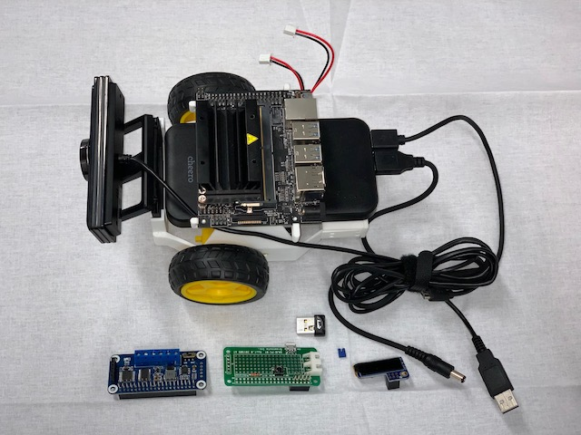

## Step 2. ジャンパピン、Wi-Fiドングル、モータードライバ基板を接続

ジャンパピン、Wi-Fiドングル、モータードライバ基板をJetson Nanoに接続してください。それ以外の部品、ケーブルはまだ接続しません。

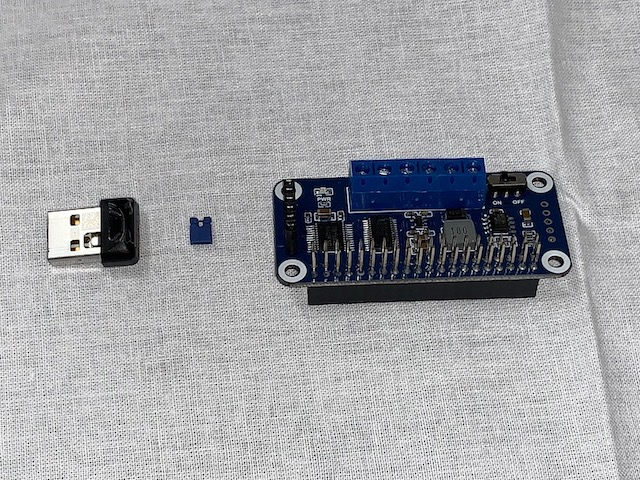

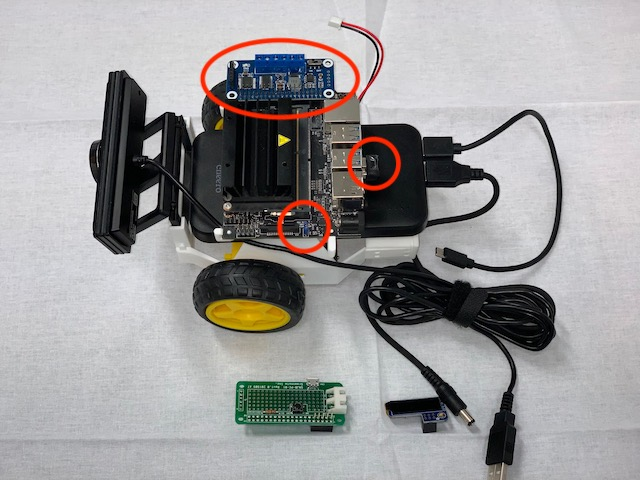

モータードライバ基板の接続は誤りやすいポイントです。下図のとおりズレ無く挿入されていることを確認してください。

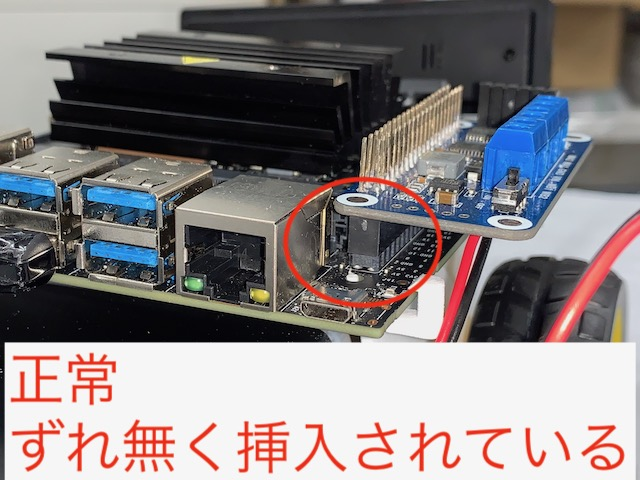

下図のようになっているとBasic Motionの実行に失敗します。

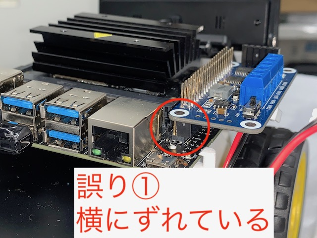

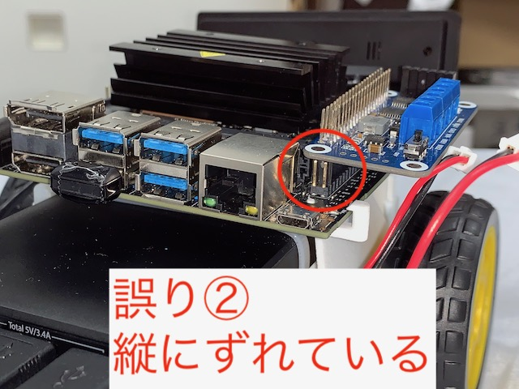


## Step 3. 電源を接続して起動

バッテリーとJetson Nanoを電源ケーブルで接続して起動します。バッテリーの電源ランプが点灯していない場合は電源スイッチ（SW）を押してONにします。

Jetson NanoのLED、モータードライバ基板のLEDが点灯することを確認してください。

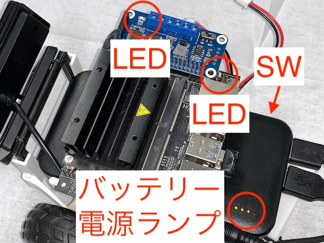

バッテリー電源ランプが点灯しているがJetson NanoのLEDが点灯しない場合、すぐに電源ケーブルを抜いてください。その後、Step 1.　に戻って作業を再開してください。それでも同じ状況が継続する場合はハードウェア故障の可能性があります。別の方法でJetson Nanoが起動できるかどうか確認してください。

## Step 4. Jupter Notebookに接続してモータードライバの動作確認

ウェブブラウザでJupiter Notebookに接続し、下記の手順に従って動作確認を行います。

1. ファイルメニューから ``Shutdown All Kernels`` を選択し、実行中のカーネルを全て終了
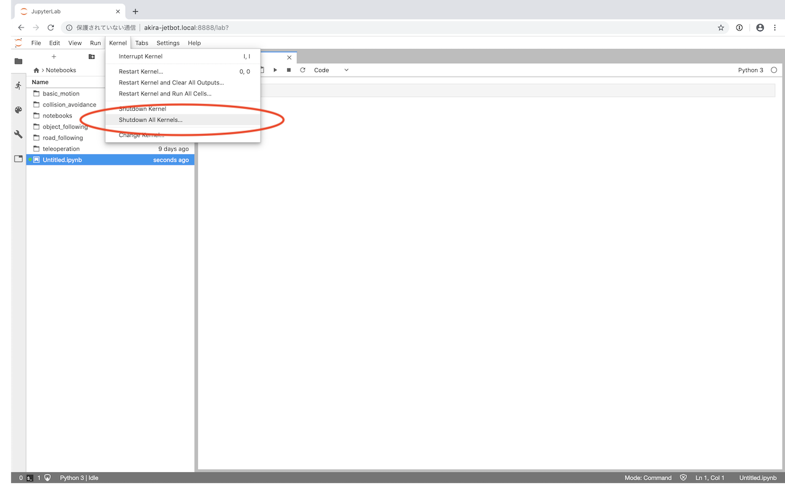
1. 新しいノートブックを作成
    * ``+``ボタンを押し、``Launcher`` 画面を表示
    * ``Launcher`` 画面から ``Python 3``　を選択
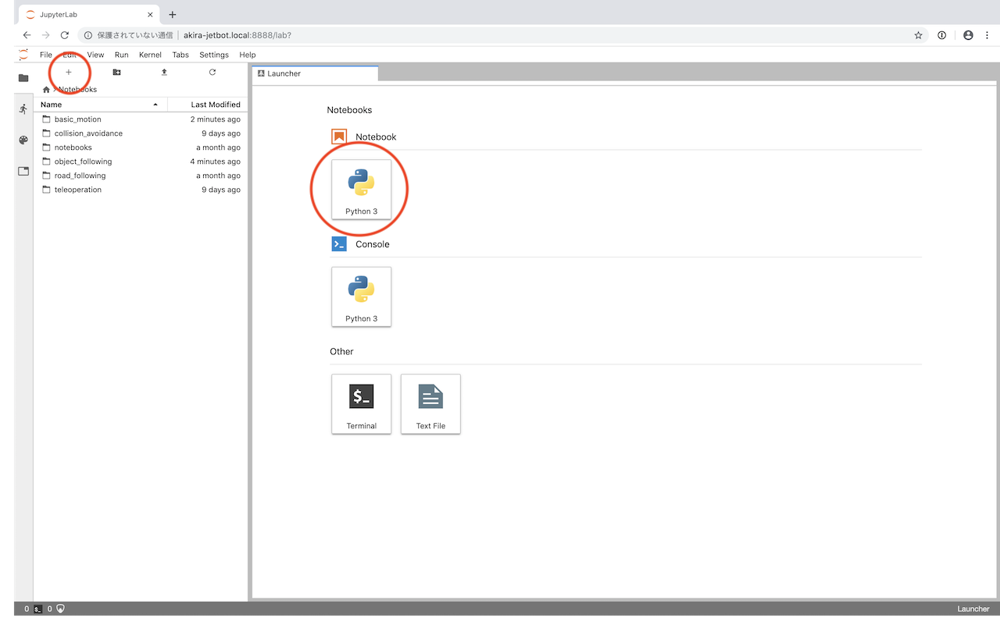

1. セルに ``!i2cdetect -r -y 1`` と入力し、実行
    * Jetson Nanoに接続されているI2Cデバイスの一覧が表示されます。
    * ``40:40`` という表示があることを確認します（下図の赤丸部分）。
      * モータードライバがI2Cバスのアドレス ``0x40 `` に接続されているという意味です。
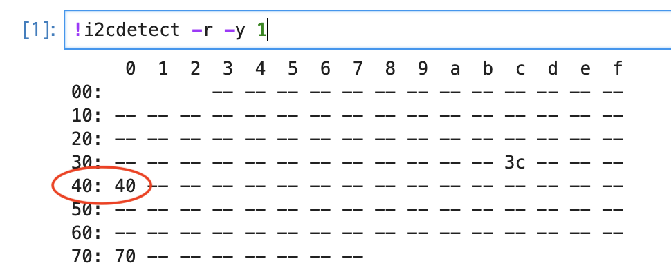
1. セルに``from Adafruit_MotorHAT import Adafruit_MotorHAT``　と入力し、実行
    * エラーが出た場合はマイクロSDカードの作成に失敗しています。[ソフトウェアのセットアップ](Software-Setup.md)から作業をやりなおしてください。
1. 次のセルに``motor_driver = Adafruit_MotorHAT(addr=0x40, i2c_bus=1)`` 　と入力し、実行
    * エラーが出た場合はモータードライバとの通信が失敗しています。
        * Jetbotをシャットダウンした後、Step 1.に戻って作業を再開します。それでもそれでも同じ状況が継続する場合はハードウェア故障の可能性があります。エラー画面のスクリーンショットを添えて購入元に連絡してください。
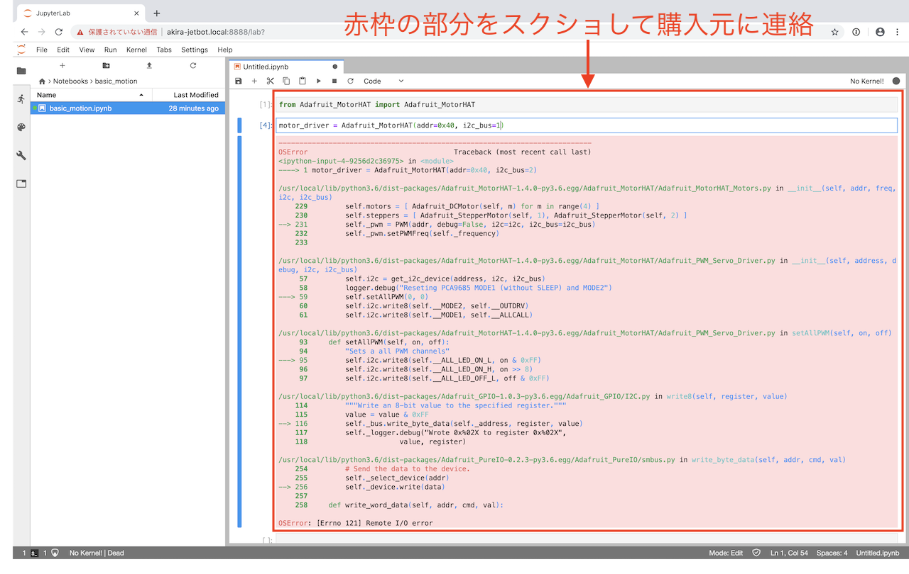

正常に実行できたら、Jetbotをシャットダウンして次の作業に進んでください。

## Step 5. 再度組み立て後、動作確認を継続

モータードライバの動作確認ができたので、Jetbot全体の動作を確認します。元通りにJetbotを組み立てた後、Jupiter NotebookからBasic Motionを実行します。

1. モータードライバ基板の上にコネクタ基板を挿入します。
    * コネクタ基板の接続は誤りやすいポイントです。下図のとおりズレ無く挿入されていることを確認してください。
    * 挿入ポイントは2ヵ所あります。両方が正常に挿入されていることを確認してください。
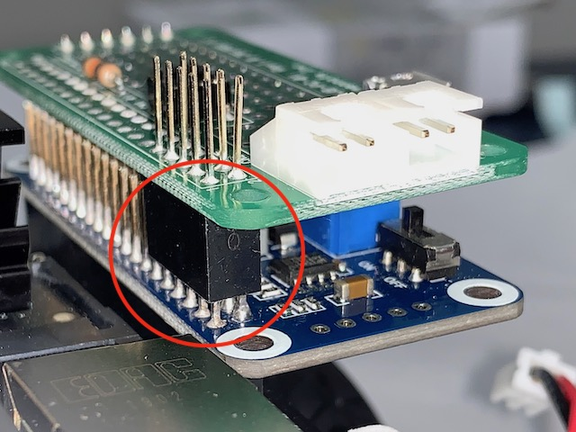
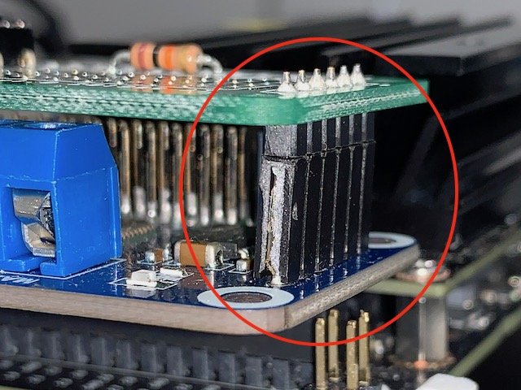
1. コネクタ基板の上にPiOLEDを挿入します。
    * PiOLEDの接続は誤りやすいポイントです。下図のとおりズレ無く挿入されていることを確認してください。
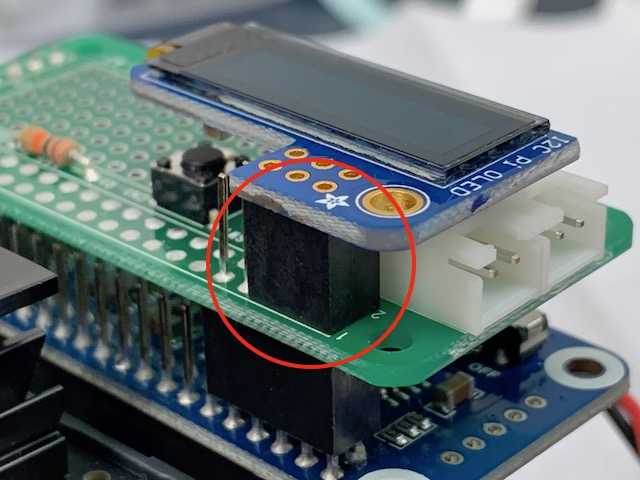
1. モーター配線（2本）をコネクタ基板に接続します。
    * 左右をよく確認して挿入してください。シャーシからはみ出している長さが短い方が左、長い方が右です。
    * モーター配線は故障の発生しやすい場所です。断線していないか確認してください。
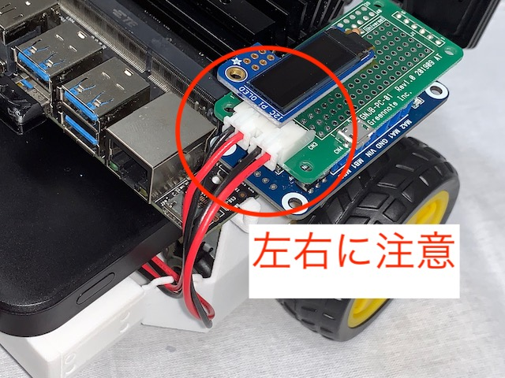
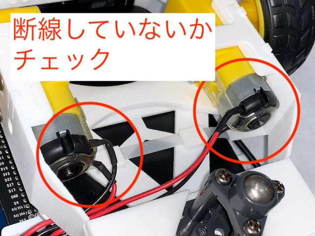
1. 残りのケーブル（USBカメラ、USBケーブル、電源ケーブル）を接続し、Jetbotを起動します。
1. PCからJupiter Notebookに接続し、Basic Motionを実行します。
    * ``robot = Robot()`` までは正常に動作するはずです。
    * Jetbotの周囲に障害物が無いことを確認してから ``robot.left(speed=0.3)`` を実行します。
        * Jetbotがその場で左回りに回転したら動作確認終了です。Jetbotは正常に動作しているはずです。
1. Jetbotが左回りに動くが、動作がスムーズでない場合は次の手順に従ってください。
    * Jetbotを持ち上げた状態で再度試し、どちらの車輪がスムーズに回っていないか確かめます。
        * スムースに回っていない側のモーターの取り付けねじをゆるめ、車軸が中央にくるよう調整して締め直してください。
    * 左右の車輪ともスムーズに回る場合、Jetbotの動作は正常ですが床の材質が柔らかすぎます。堅い床の上で試してください。
        * 堅い床の上で動かせない場合、``speed=0.3`` の数値を増やすことでJetbotを動かすことができます。この場合、Jetbotの動作速度が速くなるので注意してください。
1. Jetbotが動かない場合、またはどちらかのタイヤを中心に回転する場合はJetbotを持ち上げた状態で再度試してください。
    * 左右の車輪が逆向きに回る場合、Jetbotの動作は正常ですが床の材質が柔らかすぎます。堅い床の上で試してください。
        * 堅い床の上で動かせない場合、``speed=0.3`` の数値を増やすことでJetbotを動かすことができます。この場合、Jetbotの動作速度が速くなるので注意してください。
    * 左右どちらかのタイヤが回っていない場合、モーターの配線を確認してください。
        * モーターの配線に問題がない場合、モータードライバ基板またはコネクタ基板の故障の可能性があります。購入元に連絡してください。
    * 左右どちらのモーターも回っていない場合、モータードライバ基板から「キーン」という音がしているかどうか確認してください。
        * 音がしている場合はモーターの配線を確認してください。
            * モーターの配線に問題がない場合、モータードライバ基板またはコネクタ基板の故障の可能性があります。購入元に連絡してください。
        * 音がしていない場合はモータードライバ基板またはJetson Nanoの故障の可能性があります。購入元に連絡してください。

以上